# Slime Blast Commentary

## Project Outline

```markdown
- Provide a concise description of the project, including its core concept and purpose.  
- Outline the initial goals or objectives you aim to achieve.  
- Identify any anticipated challenges or potential issues that may arise during development.
```
Slime Blast is a story-driven first person shooter with a sci-fi setting. The player controls a humanoid slime creature, and the gameplay revolves around the slime's ability to morph into and out of a smaller blob form that allows them to move around quicker, stick to walls, and squeeze through pipes and grates, which they would not be able to normally do. The gameplay also involves gunplay, as the player will encounter enemies that they must defeat by using various sci-fi weaponry found throughout the game.

```
- Sci-Fi first person shooter where you play as a humanoid slime creature.
- I wanted to move away from my usual genre of 3D platformers and I have recently been playing first person shooters
- I wish to include multiplayer but that's new to me.
- I wish to publish this game professionally, working with professional pipelines (detail these later) (uploading builds to platforms, working with version control, etc.) 
```
I wanted to move away from my usual genre of 3D platforms, and I have recently been playing first person shooters, so I decided to choose that genre.
I also want to include multiplayer as I felt nostalgic towards older games that had PVP multiplayer modes, pitting friends against each other in deathmatch or capture the flag modes.

I want to publish this game professionally, working with professional pipelines such as uploading builds to platforms using Github, making use of game branches and working with version control.

## Research

### Methodology  

```markdown
- Identify relevant sources for the project, including articles, documentation, talks, and games.  
- Detail how these sources have informed your practical work and influenced your approach.
```
I have identified a few key challenges I will likely face while developing this project;

Creating a Story Driven FPS
I feel the best way to go about creating a story driven First-Person shooter will be by playing other story-driven games as well as reading articles about them to give me an understanding of how they are designed as well as the reception surrounding the games at the time and whether people enjoy them.

---

Multiplayer in Unreal
I have not dealt with Multiplayer in Unreal Engine before, so to learn how to create multiplayer, I will look at both YouTube videos and Unreal documentation to get a good understanding on how to get it working.


---

Publishing for Steam
Depending on how the project goes, I may be publishing my game to the Steamworks API. If this is the case, then I must ensure that I am am compliant with Valve's terms & conditions and service agreements as a publishing platform. So I need to follow the API guidelines.


## Game Sources  
```markdown
- Conduct research on games that are relevant to your project. Provide a brief description of each game and the insights it offers.  
- Analyse the game's approach, cross-referencing it with other sources such as articles or talks to support your analysis.  
- Explain how these insights apply to your project and influence your decision-making process.
```
### Metroid Prime
Metroid Prime is a Sci-Fi first person shooter developed by Retro Studios Metroid Prime (2002).
*Metroid Prime* is considered one of the best video game experiences of all time and the top GameCube game according to IGN (The 25 Best GameCube Games of All Time - IGN, 2023).

The level design in Metroid Prime features large environments comprised of multiple interconnected rooms. (Boss Keys - YouTube, 2019)
The level design is largely non-linear, there are a lot of paths the player can follow, some take them to other areas of the map, and some areas feature small challenges that the player can complete to get extra items.


<small>Figure 1: Showcase of the Environment in Metroid Prime. The player has multiple directions they can take throughout the level. They can climb up the stairs off to their right and cross over the bridge, head underneath the bridge, or head down the tunnel to the right to find a save room. </small>

Alongside studying the environment of Metroid Prime, I also liked the fact that they contextualise the First Person Mechanic as an In-Helmet Viewpoint, and all of the information on-screen is being projected onto the helmet's visor. Sometimes you can even see the character's face reflected in the glass if you stare at a bright explosion. I took heavy inspiration from this when designing my character and taking into account the first person viewpoint.

The gameplay of Metroid Prime consists of combat, puzzle solving and exploration. The combat is divided into both shooting enemies as well as moving to avoid their attacks. This makes the combat in Metroid Prime feel more fluid and active than other more modern first person shooters that typically feature stationary cover-shooter combat centered around hiding behind walls, and then shooting enemies when you get the opportunity, which tends to make encounters blend together.


<small>Figure 2: Example of Combat in Metroid Prime. The player is facing an armoured beetle that cannot be damaged from the front. They must strafe around it to avoid its charge attacks, and then attack its vulnerable back to defeat it. </small>

Since combat is going to be a large part of my game, I wanted to make sure the combat feels fluid and fast-paced to keep the game engaging, which is why I chose to look at Metroid Prime's combat, as while the game mainly consists of exploration, combat is always dotted throughout to give the player a dose of action (IGN, 2002).

---

### Bioshock
Bioshock is a story driven first person shooter developed by 2K Boston, released in 2007. Since I was attempting to make a story-driven game, I chose to look at Bioshock as it is largely considered one of the best story-driven games of all time, with its unique underwater setting, engaging story and immersive environmental storytelling (IGN, 2007).

The gameplay of Bioshock is a mix of exploring the environment, solving small puzzles and learning about the game's world, and fast-paced first person gunplay. Featuring combining several different guns, and also magic powers such as blasts of electricity or grabbing objects with telekinesis. 
The player is encouraged to experiment with numerous combinations of weapons and powers as many have different effects in combat, leaving it up to the player's inventiveness on how they wish to approach fights. (IGN, 2007).


<small>Figure 3. Screenshot of Bioshock. The player experiments with a newfound weapon combination by stunning an enemy with electricity before shooting them, making them take more damage, rewarding them for their experimentation. </small>

I studied the combat in Bioshock because I want to incentivise and reward players for getting creative at defeating enemies. Trying out different weapon combinations and approaching combat encounters differently can lead to an interesting form of replay value as well as keeping players entertained.

The level design is a mix of large areas to explore, open arenas where the player has to fight numerous enemies, and optional side areas that contain challenges the player must overcome which reward them with items such as extra ammo, or money to spend.


<small>Figure 4. Screenshot of Bioshock. The player can uncover the narrative of a large-scale conflict that left the city in ruin and decay, which is reflected in the environment as the player explores. </small>

Studying the level design of Bioshock was great for learning how they manage to create several locations that all tell the story of an underwater utopia that fell to anarchy and ruin.

The progression of Bioshock involves travelling to different areas with a set objective the player must reach, though how they reach that goal is up to them. There are usually multiple ways the player can reach the destination, such as different routes to take, or different approaches that affect what enemies they may encounter. 

The player is given new weapons throughout the game to add more variety to their loadout. The player can also upgrade their weapons at any time throughout the game by visiting upgrade stations found throughout the environment, spending their money to make their current weapons more powerful.


### Academic Sources  
```
- Research academic papers, books, or articles that provide theoretical guidance for your project. Include a brief summary of each source.  
- Describe how the academic research applies to your project and shapes your design and development decisions.
```

#### Flow and Immersion
For an academic source, I chose to look at Flow and Immersion in First-Person shooters (Nacke and Lindley, 2008). The article reports the results of a psychological study about how different aspects of Half-Life 2 affected player's gameplay experience.
The study reported that players were more engaged when playtesting levels that were designed for combat-orented flow, when compared to levels that featured empty levels, weak enemies with little visual variety, repeating textures and models, limited choice of weapons, and an overload of health and ammo supplies, leading to very little challenge and no sense of enjoyment.

I chose to analyse this source as the level design would be a large factor in my game, and I want the player to feel engaged while playing my game, as boredom can greatly reduce their enjoyment. There should be a focus on making the level design interesting to explore and by also balancing the game's challenge, such as enemy vareity and difficulty, the frequency of health pickups, checkpoints and weapon unlocks.

### Documentation Sources  
```
- Investigate relevant documentation, tutorials, or instructional videos that provide technical insights into your tasks. Summarise the content and its relevance to your project.  
- Explain how this technical knowledge supports your project work and guides your decision-making process.
```
Since I wanted to create a local multiplayer mode in my game, I looked at Epic Games' (2025) Unreal Engine documentation on how to create local and networked multiplayer (Unreal Engine 5.5 Documentation s.d.).

I also looked at the Unreal Engine forums to see some common issues people were having with getting multiplayer working properly.

(How do I create a split-screen game? - Programming & Scripting / Blueprint, 2015)

(Any tutorials to make a local multiplayer game? - Programming & Scripting / Multiplayer & Networking, 2016)

I also looked at a few YouTube videos dedicated to creating basic multiplayer modes in Unreal Engine. The first video I looked at was about creating a basic split-screen multiplayer mode in Unreal Engine by MikeTheTech (2023). The video was a short demonstration on configuring the editor settings and adding a second player to the game.

I watched a separate video which was about creating multiple players and assigning inputs to them in a fighting game by UNREAL ENGINE JOURNEY (2023). This video walked through creating multiple players at the start of the level, and assigning input mapping contexts to both of them.

## Implementation

### Process
```
- Provide a step-by-step breakdown of your development process, including key milestones and decisions made throughout the project.  
- Highlight any tools, frameworks, or techniques used, and explain how they contributed to the implementation.  
- Include screenshots, diagrams, or code snippets where relevant to showcase your progress.
```

My Prototype consisted of a basic first-person shooter, including movement, the weapons, and the ability to morph into a ball. 

The project was 14 weeks long, so I used an Agile development methodology. Using the website Trello, I divided the time into 7 sprints each lasting two weeks and then I divided my tasks among each sprint so I could spend multiple weeks working on a few mechanics. This aligned with regular feedback sessions we would have in lessons where we would reflect on what we completed, and what we planned to do over the next few weeks.

<a href="https://trello.com/b/ptuu1F31/final-major-project">Link to Trello Board</a>

## Weekly Breakdown

### Week 1-2

#### Multiplayer Prototyping
- Spawning Multiple players (mention the Unreal Documentation since I couldn't get the second player to work right originally)
- Respawning
- Multiplayer objects (Weapon Swap System and Healing Station)

Looking at the Documentation showed me the basics on creating a simple local multiplayer mode to my game. I learned what to adjust in the settings to change the splitscreen view to a vertical splitscreen instead of a horizontal one, and then how to add extra local players which I then set to be possessed. However I was facing difficulty with getting the second player to actually be controllable, so I had to look at some YouTube video tutorials as well to see how I could get it working.

The first youtube video I looked at  was a short demonstration on configuring the editor settings and adding a second player to the game. This helped to organise my existing code a little as it essentially recapped what I read about in the documentation, but it did not solve my issue of the second player not receiving input.

Another video I watched mentioned the important detail I was missing, that the input mapping context needs to be assigned to a different ID for each player (player one has an ID of 0, and player two has an ID of 1), which I had not implemented so it was attempting to possess both characters with the same player ID. I edited code and changed the script that adds multiple players to also assign a different ID to both of them. Doing this allowed the second player to work with a second controller.

This is the code that the multiplayer level executes to spawn multiple players. I controlled the amount of extra players it spawns via a separate integer variable, but it essentially just spawns in the initial character, and then spawns in the other player characters after that using an **Add local player** node, making sure they're all possesed correctly.

<iframe src="https://blueprintue.com/render/1ix-1un3/" height= 512px width=100% scrolling="no" allowfullscreen></iframe>

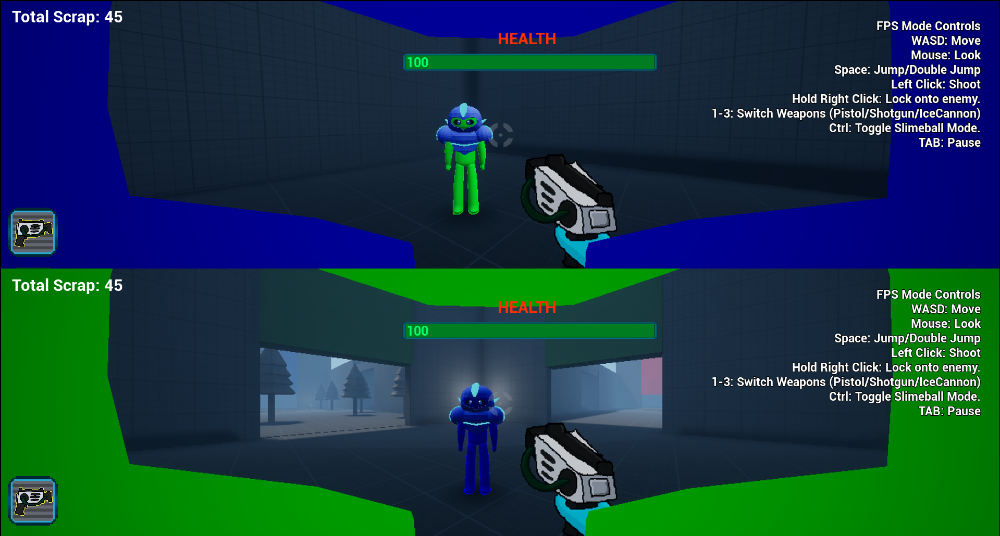

<small>Figure 5. The viewport in the multiplayer level. Two characters have spawned in, and are positioned so they are both looking at each other, demonstrating the success of the local co-op splitscreen view. </small>

#### Reworking Weapons into 2D Sprites
I turned the weapons into 2D sprites to make them easier to develop. During the prototype phase of the project I used 3D models for the weapons, however this made it harder to create multiple weapons due to having to model, texture, rig, and animate every weapon. Which was a lot of wasted time that I could have spent on other parts of the game.

The weapons became a simple 2D flipbook of the weapon's firing animation. By default it idles on the first frame of the animation, and then plays when you shoot the weapon.

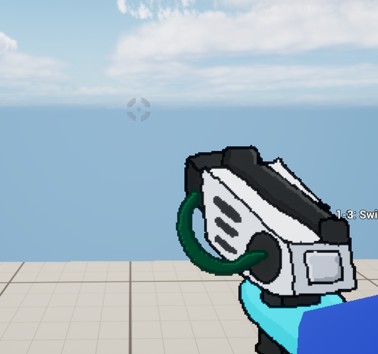

<small>Figure 6. In-game view of the pistol, the player's starting weapon. The pistol is now a 2D sprite instead of a 3D model. </small>

#### Strafing Camera Tilt
When working on my project in one of my lessons, my teacher Assad suggested that I should make it so that when the player moves from side to side, the camera tilts in that direction to make the camera feel more lively. I thought it was a great idea and started to work on it almost immediately.

The code gets the player's velocity multiplied to their right vector, and adds the two values together. This returns the player's sideways velocity, which is then used to get the value of a curve float with different points at the maximum and minimum speed that the player can walk. Therefore, if the player walks left and their velocity is -525, the curve returns a value of -3, which is then set as the player camera's X rotation. 

<iframe src="https://blueprintue.com/render/yk0lzuua/" height= 512px width=100% scrolling="no" allowfullscreen></iframe>


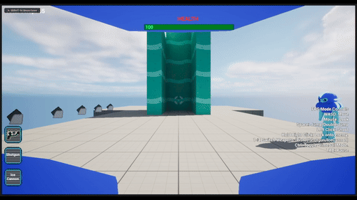

<small>Figure 7. Gif demonstration of the strafing camera tilt in action, the camera bends in the direction that the player is moving.</small>

### Week 3-4

#### Changing Weapons (Data Table)
My first task for the next week was changing the weapon system from a series of switch statements to a Data table system. 

I started by creating a struct containing everything related to the weapons such as their sprite flipbook, shoot sound, bullet to shoot, and shot particle.
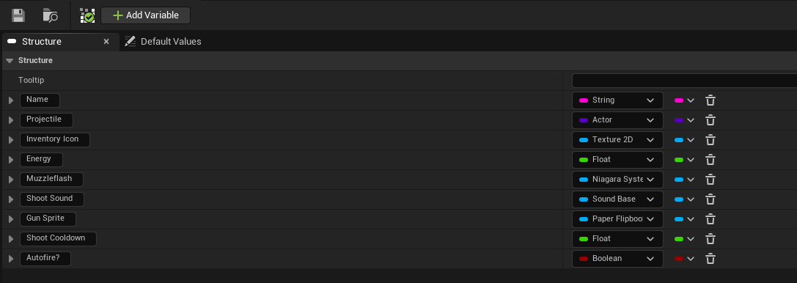


<small>Figure 8. The lock-on mechanic demonstrated in Metroid Prime. The player is fighting multiple flying enemies that dart around the screen shooting at the player. The lock-on system allows the player to constantly look at a targeted enemy, to make it much easier to hit them. </small>
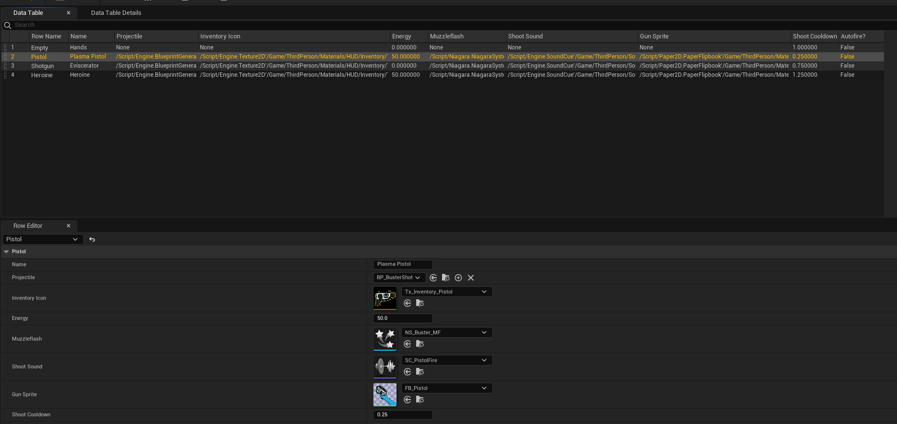


<small>Figure 9. The lock-on mechanic demonstrated in Metroid Prime. The player is fighting multiple flying enemies that dart around the screen shooting at the player. The lock-on system allows the player to constantly look at a targeted enemy, to make it much easier to hit them. </small>


<iframe src="https://blueprintue.com/render/ibkhbjci/" height= 512px width=100% scrolling="no" allowfullscreen></iframe>


#### Lock-on System

I created a lock-on mechanic since both the player and enemies would be moving constantly, having a mechanic to lock the player's view to an enemy would greatly help the player with being able to land hits much easier. 

Metroid Prime, being one of the main inspirations for my game, features the lock-on system to make up for the limitations of the console it was on. The player used the left stick for both moving and turning, and used the lock-on mechanic to focus on enemies to attack them.


<small>Figure 10. The lock-on mechanic demonstrated in Metroid Prime. The player is fighting multiple flying enemies that dart around the screen shooting at the player. The lock-on system allows the player to constantly look at a targeted enemy, to make it much easier to hit them. </small>

My initial lock-on mechanic used a **Get all Actors with Tag** node that I used to find actors with the lock-on tag, then using a **For Each Loop** to find the closest actor that was also on-screen. However I quickly found that since it was collecting references for every actor that had the tag regardless of where they were in the level, the mechanic was quite performance heavy and would sometimes cause the game to stutter for a second when there was a large amount of enemies present in the level.


### Old Lock-on System
<iframe src="https://blueprintue.com/render/4_7s5gqu/" height= 512px width=100% scrolling="no" allowfullscreen></iframe>

<small> Event tick loop, keeps focusing on the locked actor so long as the actor is still relevant and the player hasn't released the keybind. </small>

When I redesigned the lock-on system, I decided to use a box raycast to find any enemies that the player is looking at. Though I faced an apparent issue that the raycast would keep getting blocked by the environment, so I created a new collision type called "Lock-On Target" that could only be detected by the raycast.

With the custom collison type working correctly, now I wanted to make sure the lock-on prioritised the right targets. So I made the check perform two raycasts. The first raycast is a smaller sized check that checks in the direction the player is looking, and then if that doesn't find any actors, then it performs a second check that has a much wider range. That way, the lock-on prioritises enemies the player is looking at, and if not, then any enemies nearby to where the player is looking.

### Find Lock-on Target
<iframe src="https://blueprintue.com/render/9fh7on7f/" height= 512px width=100% scrolling="no" allowfullscreen></iframe>

Once a lock-on target has been found, the game then loops the main body, which consists of making the player look at the targeted actor, along with constantly checking whether the loop should continue. It checks if the actor has been destroyed, if it's off-screen, or whether the player can no longer see the actor. If any of these become true, then the loop breaks and the lock-on stops.

### Main Lock-on loop
<iframe src="https://blueprintue.com/render/oh7zfutz/" height= 512px width=100% scrolling="no" allowfullscreen></iframe>


<small>Figure 11. Demonstration of Lock-On mechanic in-game. Visual effects appear on-screen to indicate that the check for a valid lock-on target was successful, and follow the player's position. </small>

#### Spline Pipe System
I created a pipe system that the player can move through while in Slimeball mode. The pipe system creates a spline mesh, and then sets the position and curvature of the mesh based on the location and tangent of an attached spline. This allows me to bend, curve, and add as many points as I wish to the pipe to make them flow nicely.

The construction script gets the number of spline points, and then for each index gets the location and tangent of that point for the starting position, then adds 1 to the point index to get the location and tangent of the next point to set as the end position.

I had to subtract two from the count though, as I noticed that it counted the first and last points twice; the first point was calculated by default, and it was unnecessary to repeat the process for the last point, as the second to last point would set its end point to the last point's position anyway.

<iframe src="https://blueprintue.com/render/b-obyc81/" height= 512px width=100% scrolling="no" allowfullscreen></iframe>

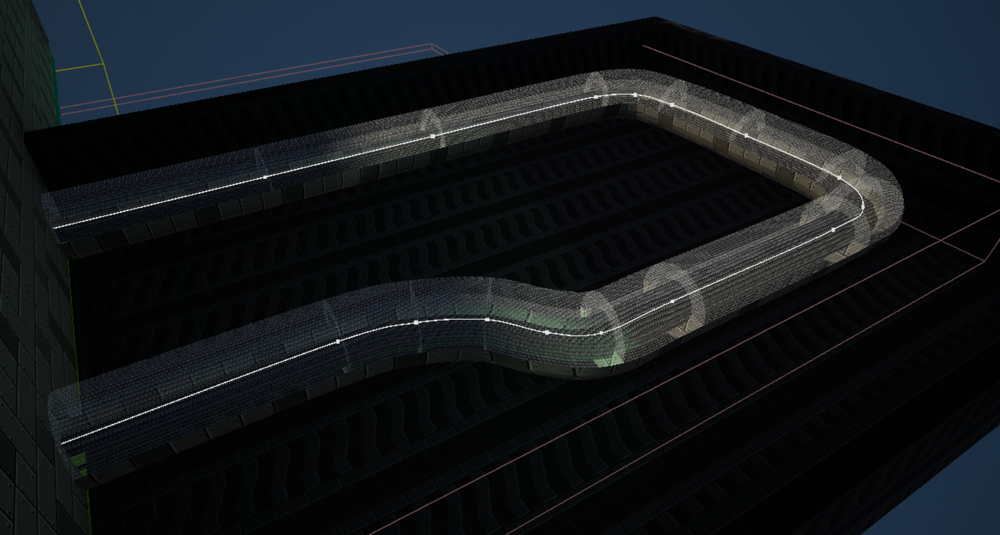

<small>Figure 12. One example of the spline pipe in the editor. The spline mesh follows the path created by the spline. </small>

### Week 5-6

#### UI Design (HUD, Pause Menu)
Next I wanted to create the player's HUD, for score and health tracking, as well as displaying other relevant information.

Most of the variables are tracked by the player, so I had the player create a HUD widget on event begin play, while also providing it a reference to itself.

The HUD then uses this reference to keep track of the player's score, health, and current weapons.

### Get player health code

<iframe src="https://blueprintue.com/render/x-hul6y-/" height= 512px width=100% scrolling="no" allowfullscreen></iframe>

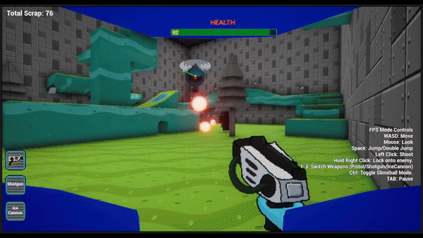

<small>Figure 13. Showcase of the HUD tracking the player's health decreasing when they take damage. Also note the red flashing effect to indicate that the player is taking damage. </small>

#### Extra Slimeball Features
While in Slimeball mode, the player has access to a few extra features.

When the player attempts to double jump in Slimeball mode, the game first does a short sphere trace forwards to see if they are facing a wall. If they are, then the Slimeball performs a wall jump instead, allowing them to gain extra distance. They can chain these jumps together to scale walls.

### Wall Jump Code
<iframe src="https://blueprintue.com/render/1dlr_lgs/" height= 512px width=100% scrolling="no" allowfullscreen></iframe>

Originally, the camera in slimeball mode felt rather static, so I created a tracking camera system.
While the player is in Slimeball mode and moving, the camera will track and follow the player, making the camera feel more fluid in Slimeball mode.

### Tracking Camera Code
<iframe src="https://blueprintue.com/render/2gr7ypvn/" height= 512px width=100% scrolling="no" allowfullscreen></iframe>

### Week 7-8

#### Drone Enemy

I wanted to make a new enemy type. As I only had one type of enemy in the game. I decided on a flying enemy being a hovering drone. The drone is stationary in the air on the occasion he moves to a random position near to where it started. It also occasionally fires projectiles at the player. The Drone is also a sprite, similar to the weapons, as it made it easier to focus more on the mechanics than making and animating a model.

#### Drone Code
<iframe src="https://blueprintue.com/render/kj8jlp4p/" height= 512px width=100% scrolling="no" allowfullscreen></iframe>

#### Enemy Behaviour Tree
- Behaviour Tree Setup
- Move Task
- Shoot Task

<iframe src="https://blueprintue.com/render/agtl70em/" height= 512px width=100% scrolling="no" allowfullscreen></iframe>


### Week 9-10

#### Level Prototype
During Week 9-10, I worked on a level for players to play through, as up until that point I was working solely from a barren test level. The level is short, but features a starting tutorial section teaching the player basic mechanics such as movement and jumping, then introducing them to the slimeball mode. Lastly, the player is told about the basics of combat and is then pitted against a few enemies.


### Week 11-12

#### Final Boss
I wanted to have a definitive way to end the game, so I thought a fight against a boss would work. I didn't want to make anything too major, so the boss is essentially a larger, stronger version of the basic move/shoot enemy. It just has a lot more health and shoots faster for a bit longer.

I decided for a joke to have the boss be an image of a cat. Though I thought it better if I drew my own version using the image as reference. I put the original image in the declared assets since I used it as reference.

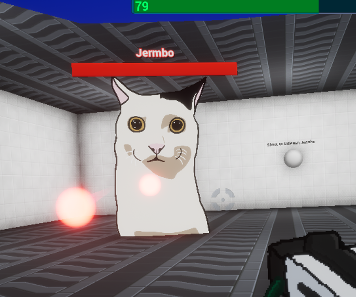

<small>Figure  14. Screenshot of the boss in-game</small>

#### Fixed Camera System

<iframe src="https://blueprintue.com/render/i6r1-_rk/" height= 512px width=100% scrolling="no" allowfullscreen></iframe>

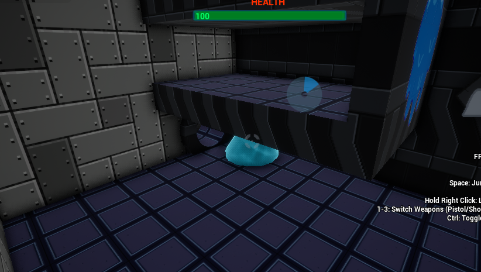

<small>Figure 15. Demonstration of the Fixed Camera Angle pointing at the player from the corner of a room. </small>

#### Scrap
<iframe src="https://blueprintue.com/render/2p9u5xlz/" height= 512px width=100% scrolling="no" allowfullscreen></iframe>

### Week 13-14

#### Mechanics based on Tester Feedback

- Hint Notifications
<iframe src="https://blueprintue.com/render/pbxgxtg7/" height= 512px width=100% scrolling="no" allowfullscreen></iframe>


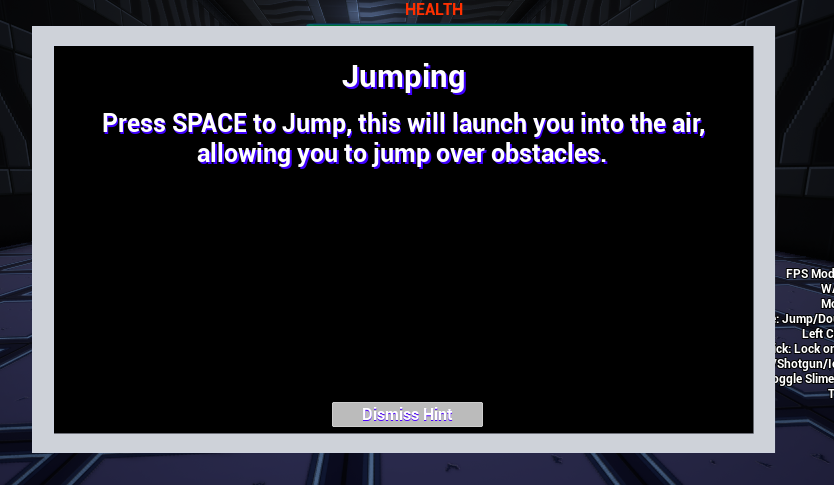

<small>Figure  16. One of the hint popups explaining how to jump.</small>

- Hiding the player's helmet
<iframe src="https://blueprintue.com/render/kqtkc-uo/" height= 512px width=100% scrolling="no" allowfullscreen></iframe>

---

### New Approaches  
```
- Detail any innovative or new approaches you explored during the project.  
- Explain why these approaches were chosen and how they differ from standard practices.  
- Evaluate the success of these approaches, including any challenges faced and lessons learned.
```

During this project, I explored some new approaches while developing my project I started doing a lot more user testing than I usually would. As most class projects would consist of me making the game, and submitting it without conducting much user testing, as they were simply showcases of mechanics I have made. As such, I was expected to have other players test my game to make sure all of my mechanics were working correctly. As well as this, we were going to be publishing our project, and I wanted to make sure other players could easily understand how the game works.

The user testing in my project was very insightful, as I learned how other players approach a new game. Since I have been working on this project from the start, it’s very helpful to see how someone who has never seen the game before will react to mechanics in my game.

Our teacher also showed us more industry standard techniques, I also learned to make my code easier to understand by keeping it organised and annotated throughout throughout so that anyone looking at my code could understand it much easier.

I found it helpful as it helps me remind myself about mechanics I created earlier into the project when I return to the later, as I may have forgotten. This was a fairly common issue with projects I made earlier on in my course.

### Testing
``` - Document the user testing conducted, specifying the type of tests used (e.g., automated testing, guided user testing, blind testing).  
- Present feedback or issues identified during testing, using graphs, tables, or visual aids to summarise results.  
- Describe how these issues were addressed. If any issues were not resolved, provide a clear justification for leaving them unaddressed.
```
Before getting other playtesters to test my game, I would conduct a lot of self testing. Making sure that all of the mechanics work properly and don't have any unexpected bugs.

A lot of the testing in my project was guided user testing where I walked the players through the game, explaining important mechanics and what they need to do to progress. I also conducted some blind user testing, allowing the players to play my game without guidance from me, leaving it up to the player to figure out important mechanics and what they need to do, which was important as I wanted to make sure players could naturally figure out how to progress in the game.

After players had tested my game, I set up a Google form that players could access by scanning a QR code on both the title screen and the victory screen after the game is complete. The form allowed the play testers to give feedback as well as rank how they feel about some of the mechanics in my game. Overall, I received a lot of good feedback, though there were some issues that players identified that I needed to address.


I compiled my results of the test into a spreadsheet.


<iframe src="https://docs.google.com/spreadsheets/d/e/2PACX-1vRbXxYJNSVEDSAm15R9XytUcPyPositSmVFDCkRcOeBNb4c_Qh3OBNLRB4v5YuPbLODLJ61KFN9y1M0/pubhtml?gid=934916183&amp;single=true&amp;widget=true&amp;headers=false" height= 512px width=100% allowfullscreen></iframe>
<small>The results of testers filling in my feedback form. </small>


Summary of Results
- 100% of players like the move speed of the humanoid character, however 42.9% of players think the Slimeball moved too fast.
- 100% of players appreciated having a second jump in midair, as it helped to land precise jumps more easily.
- 100% of players liked the fixed camera mechanic where the camera would shift to a new perspective when moving through pipes.
- With the knowledge that the Slimeball mode is meant to be a limited time ability, 71.4% of players thought that the slimeball mode lasted too long.
- The question about whether or not players used the Lock-on mechanic was the most impacted by not being explained well enough in the game itself, as while the majority answered that they used it a lot or from time to time, at least 28% of the players said they didn't use the mechanic or even knew it existed.
- The players liked the fact that the weapon selection was limited to 3 slots, as having several weapons available at once all with infinite ammo would've meant that some weapons would go practically unused.

---

Reflecting on the Data collection, a lot of the questions in the survey were Game Design related. Which ended up meaning a lot of the data in my survey wasn't all too helpful when it came to bug-fixing and improving mechanics. However after receiving the results, I decided to focus on the more major issues that players faced first, and then move towards the minor issues after that.

The playtesters felt the guns were unbalanced, some guns shot faster and dealt more damage making them superior over other guns, and some just weren't worth using.
Alongside this, the testers thought that the character feels better to control in larger areas, as when they are required to perform tight platforming, the momentum can cause the character to fall off the platforms or overshoot. These issues were quite easy to fix as most of them could be easily changed by adjusting some variables in the code or character movement script.

Some of the mechanics in the game weren’t explained very well due to having to read in-level text prompts that sometimes could be missed if the player was too quickly through the level, which meant that blind testers sometimes didn’t know certain mechanics were in the game. I made a solution to this by having on-screen pop-ups appear explaining mechanics when they became necessary, such as when the player needed to double jump across a gap or how to approach combat mechanics such as Lock-on.

The lack of sound in the game was also a common complaint, but that wasn't an issue I needed to fix since I already had sound in my game, the testers just couldn't hear it as the University PCs we were testing on didn't have sound output.

One tester noted that the boss encounter door doesn’t lock after entering, allowing them to exit the arena and avoid fighting it. To have the boss door lock after the player entered, I added a box trigger in the world that locks the door after the player goes through it in the level blueprint.

There were some issues I decided would be better to not fix as they weren't a big priority, one common issue being the level design and how the player could skip most of the combat encounters.  Whilst it was a good issue to raise, I thought it was best to prioritise my time with more major issues with the mechanics, as this was an issue with the level design which was a prototype blockout.

---
### Technical Difficulties
```
- Identify any technical difficulties encountered during the implementation phase.  
- Provide details on how these issues were diagnosed and resolved.  
- If any difficulties remain unresolved, explain the impact on the project and any mitigation strategies used to minimise their effect.  
- Reflect on what you would do differently in future projects to avoid similar issues.
```
During testing I would often face the issue of not being able to go back to the title screen after starting the game since I had not created a pause menu. I resolved that issue by creating a temporary debug level select so that I could go back to the title-screen or other levels whenever I wanted to.

Another issue I faced was that during testing, the player could fall off the level, and since there was no kill barrier in place to reset them, the player would keep falling forever. To solve this, I created a button command that respawned the player if they fell off of the level.

Since I was publishing my game, I had to make sure all of the audio was fair-use and not copyrighted. Throughout the development of my game I had implemented a lot of copyrighted audio for testing purposes, but I had to solve the issue by finding websites dedicated to copyright free or Creative Commons audio and sound effects, such as opengameart.org, which I then used to replace all of the copyrighted audio in my game.

On one occasion I forgot to have a build ready in time for my lesson that week, which meant that I could not test for errors that only show up in the builds. It was also difficult to create a build in the actual lesson since building for the first time on a new computer could take a couple of hours due to all of the assets it needs to compile. So while I didn't get around to making the build, I learned from the experience by remembering to create builds more often.

On another occasion I forgot to commit my code changes to Github, meaning when I logged on to the Uni computers to work on my game, I found that it was running a previous version of the game, lacking many of the changes I had made. I solved this issue by using remote desktop to commit my changes from the classroom, and I decided to commit my code changes more regularly to avoid repeating this issue in the future.


## Outcomes

### Source Code/Project Files
```
- Provide a link to your complete source code or project files.  
- Ensure the link is publicly accessible or shared with the appropriate permissions.  
- Include a brief description of the files provided, highlighting key components or any instructions required to run the project.
```
<a href="https://github.com/11gscanlan/AdvancedGamesProgramming_MetroidPrime/tree/FinalMajorProject">Link to GitHub Repository for the source code</a>


### Build Link
```
- Share a link to a playable or executable build of your project.  
- Ensure the build is accessible across relevant platforms and is publicly accessible.  
- Include any necessary instructions for running the build, such as system requirements or installation steps.
```
<a href="https://11gscanlan.itch.io/slimeshock">Link to a playable build of the project on Itch.io</a>

To run the build, simply download the .zip file in the download section at the bottom of the page. Then extract and run the slimeshock.exe file.

### Video Demonstration
```
- Embed a video or provide a link to a recorded demonstration of your project in action.  
- The video should showcase key features, functionality, and any unique elements of your project.  
- Include a brief commentary or text overlay in the video to explain the different aspects of your project as they are shown.
```

<a href="https://youtu.be/jkROO8pozGk">Link to a Video Walkthrough of my game on YouTube</a>

## Reflection

### Research Effectiveness  
```
- Assess the usefulness of the research conducted during the project.  
- Highlight which sources (games, academic, documentation) had the most significant impact on your work and explain why.  
- Identify any research gaps or areas where additional information could have improved your project outcomes.
```
On reflection, a lot of the research was useful during my project. Most of my time was spent making new mechanics I have not approached before.

The most significant research method I found was the game sources, as I was able to study the game as I played it, gaining an understanding for how the game works as well as learning about it.

The video tutorials were also very helpful, providing step-by-step commentaries on making new mechanics, as well as important things to keep in mind when making it yourself.

The academic sources were not as helpful as it was difficult trying to find research relevant to local multiplayer games and the impact they have on the industry, which was what I was hoping to look at with the academic sources.


### Positive Analysis 
```
- Reflect on the successful aspects of the project.  
- Highlight specific elements that worked well, such as technical solutions, creative decisions, or user feedback.  
- Provide evidence to support your analysis, such as test results, screenshots, or user comments.
```
On reflection, I think the most successful aspect of the project overall was tasking myself to make the game as fun to play as possible, such as making the controls smooth and fun, and the combat fluid and engaging. I would say that I achieved this successfully, as the most valuable element of the implementation was the user testing, as I received a lot of positive in-person feedback from players who enjoyed playing my game, as well as the tester form rating most mechanics quite well.

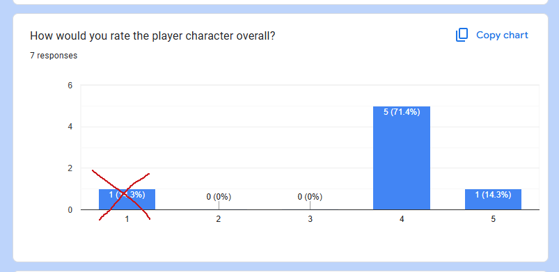

<small>Figure 17. Screenshot of Tester Feedback rating the player character. The rating is of 1-5, where 5 is the best. The graph is crossed out because one player voted 1 in error due to misreading the scoring, this vote was meant to be a top-score. </small>

### Negative Analysis  
```
- Identify the areas of the project that did not go as planned or could have been improved.  
- Discuss challenges you faced, whether technical, creative, or time-related, and evaluate their impact on the final product.  
- Reflect on any mistakes or missteps and what you learned from them.
```
However, one area of the project that did not go so well was maintaining my focus on working on my project. There were times where I struggled to focus on development, which led to me falling behind on my projected outcomes and having to catch up on what I had intended to get finished in that time.

I also fell ill during one of the first weeks of the project, which impacted the progress of the project as I wasn't able to work on it as much that week.

One key misstep I faced was not getting enough recorded tester feedback earlier. As while I had players to test my project throughout the course of my development, I only had a form for testers to fill in during the last few weeks of the project. Meaning when it came time to evidence my tester feedback in the write-up, I only had the feedback I received from the last session.

### Next Time
```
- Outline what you would do differently if you were to undertake a similar project again.  
- Suggest improvements to your workflow, research methods, or implementation process based on your reflections.  
- Consider any new tools, techniques, or approaches you would explore in future projects to achieve better results.
```
One change if I was to do this project differently would be to prepare more in advance. A lot of issues stemmed from not factoring in potential delays or issues that arose during the course of development.

Some improvements to my workflow and research methods could include working in smaller amounts more often to prevent causing me to lose focus on development. Also, I could have focused more on filling in the write-up earlier on, as I left that to the last few weeks, which meant a lot more time focusing on the write-up at the end of the unit.

To achieve better results in future projects, I would definitely utilise GitHub more, as it is very helpful with working on multiple systems, as well as being able to backup my files to a repository that also has access to version control on the slight chance I make a big mistake and have to revert to a previous version of the project.
I would also continue to use the organisation techniques I practiced as they were very helpful keeping my code tidy when I look back on it.

## Bibliography  
```markdown
- Compile a complete list of all sources referenced throughout your project. This may include articles, journals, videos, games, software, documentation, or any other materials.  
- Ensure all references are formatted according to the [university's citation method](https://mylibrary.uca.ac.uk/referencing).  
- Organise your references in alphabetical order. Alternatively, you may separate them by type (e.g., academic sources, games, videos), but consistency is key.
```

#### Figure References

Fig. 1 *Screenshot of Metroid Prime Environment* (2025) [Game still, Switch] In: Metroid Prime Remastered. Austin, Texas: Retro Studios

Fig. 2 *Screenshot of Metroid Prime Combat* (2025) [Game still, Switch] In: Metroid Prime Remastered. Austin, Texas: Retro Studios

Fig. 3 *Bioshock Combat* (2021) [YouTube video, screenshot] At: https://www.youtube.com/watch?v=FTXJfa12VDM (Accessed 14/05/2025)

Fig. 4 *Bioshock Environment* (2021) [YouTube video, screenshot] At: https://www.youtube.com/watch?v=FTXJfa12VDM (Accessed 14/05/2025)

Fig. 5 

Fig. 6

Fig. 7

Fig. 8

Fig. 9

Fig. 10

Fig. 11

Fig. 12

Fig. 13

Fig. 14

Fig. 15

Fig. 16

Fig. 17
#### Games

‘Metroid Prime’ (2002). Retro Studios.

'Bioshock' (2007). 2K Boston.

#### Game Reviews / Articles

The 25 Best GameCube Games of All Time - IGN (s.d.) At: https://www.ign.com/articles/the-best-gamecube-games-of-all-time (Accessed  10/02/2025).

The World Design of Metroid Prime | Boss Keys - YouTube (s.d.) At: https://www.youtube.com/watch?v=zyoGD6uwCmk (Accessed  10/02/2025).


Flow and immersion in first-person shooters | Proceedings of the 2008 Conference on Future Play: Research, Play, Share (s.d.) At: https://dl.acm.org/doi/10.1145/1496984.1496998 (Accessed  10/03/2025).

Testing Multiplayer in Unreal Engine | Unreal Engine 5.5 Documentation | Epic Developer Community (s.d.) At: https://dev.epicgames.com/documentation/en-us/unreal-engine/testing-multiplayer-in-unreal-engine (Accessed  11/03/2025).

How do I create a split-screen game? - Programming & Scripting / Blueprint (2015) At: https://forums.unrealengine.com/t/how-do-i-create-a-split-screen-game/321221 (Accessed  10/03/2025).

Any tutorials to make a local multiplayer game? - Programming & Scripting / Multiplayer & Networking (2016) At: https://forums.unrealengine.com/t/any-tutorials-to-make-a-local-multiplayer-game/366051 (Accessed  10/03/2025).


#### YouTube Videos

The World Design of Metroid Prime | Boss Keys - YouTube (s.d.) At: https://www.youtube.com/watch?v=zyoGD6uwCmk (Accessed  10/02/2025).

How to set up local/split-screen Multiplayer in Unreal Engine 5! (2023) At: https://www.youtube.com/watch?v=6aAQ5ttikgs(Accessed  12/02/2025).

UE5 Fighting Game Tutorial: Local Multiplayer Game With 2 Gamepads | TrueFGE & Unreal Engine 5 (2023) At:  https://www.youtube.com/watch?v=oonRBOBJcIo (Accessed  12/02/2025).


## Declared Assets
- Provide a detailed list of any third-party assets used in the project.  
- This includes asset packs, music, sound effects, 3D models, textures, scripts, or code from external sources.  
- Declare any use of AI tools (e.g., ChatGPT, GitHub Copilot, Meshy) or pre-existing code. Specify the purpose of these assets/tools and how they were integrated into your work.  
- Ensure you clearly distinguish between your original work and any external contributions to maintain academic integrity.

I used a sound pack that I found on OpenGameArt.org to replace all of the sound effects in my game with. The pack is in the public domain meaning I don't need to worry about crediting the artist in-game, though I have declared that none of the sounds are my own creation.

SubspaceAudio (2016) 512 Sound Effects (8-bit style). [Sound] At: https://opengameart.org/content/512-sound-effects-8-bit-style (Accessed  14/05/2025).

The Final Boss of the game uses a digitally drawn image of a cat. While I made that image, I traced it from an image of a real cat.

Jermbo_origin (s.d.) [Image] At: https://static.wikia.nocookie.net/regretevator/images/b/b9/Jermbo_origin.jpeg/revision/latest?cb=20240413165944 (Accessed 9/04/2025)


<a href=""></a>
