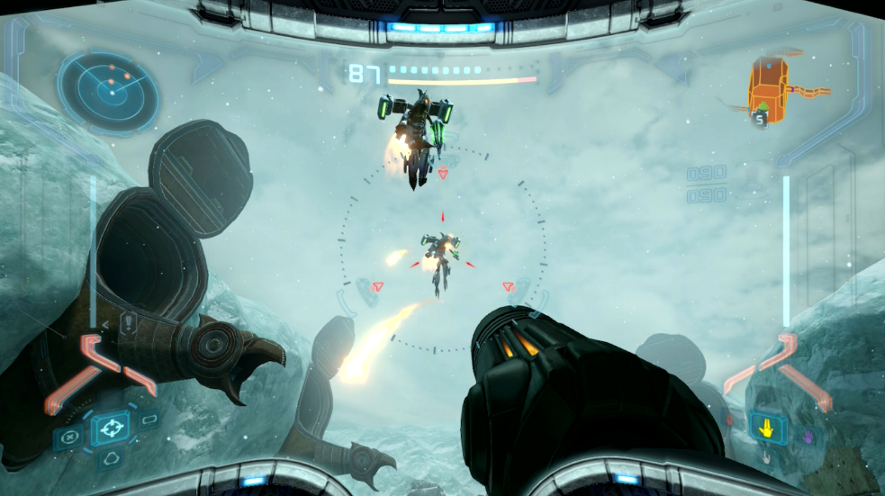

# Slime Blast Commentary

## Project Outline

```markdown
- Provide a concise description of the project, including its core concept and purpose.  
- Outline the initial goals or objectives you aim to achieve.  
- Identify any anticipated challenges or potential issues that may arise during development.
```
Slime Blast is a story driven first person shooter with a sci-fi setting. The player controls a humanoid slime creature, and the gameplay revolves around the slime's ability to morph into and out of a spherical blob form that allows them to move around quicker, stick to walls, and squeeze through pipes and grates, which they would not be able to normally do. The gameplay also involves gunplay, as the player will encounter enemies that they must defeat by using various different sciency weapons found throughout the game.

```
- Sci-Fi first person shooter where you play as a humanoid slime creature.
- I've been influenced by my playing habits, and I wanted to move away from my usual genre which was 3D platformers.
- I wish to include multiplayer but that's new to me.
- I wish to publish this game professionally, working with professional pipelines (detail these later) (uploading builds to platforms, working with version control, etc.) 
```
I wanted to create a first-person shooter as I was influenced by my playing habits, and wanted to move away from my usual genre which was 3D platformers. I wish to include multiplayer as I felt nostalgic towards older games that had PVP multiplayer modes, pitting friends against each other in deathmatch or capture the flag modes.

I want to publish this game professionally, working with professional pipelines (***detail these later***) such as uploading builds to platforms using Github, working with version control, ***etc***.

## Research

### Methodology  

```markdown
- Identify relevant sources for the project, including articles, documentation, talks, and games.  
- Detail how these sources have informed your practical work and influenced your approach.
```
- Story Driven FPS
- I feel that both playing story driven games as well as reading articles about them will give me an understanding of how they are designed, as well as seeing how other people think about the game.

---

- How to deal with multiplayer in Unreal
- I feel like YouTube videos could be a quicker solution than looking at Documentation when it comes to adding Multiplayer. 

---
- Publishing for Steam. Working with the Steamworks API
- I need to make sure I am compliant with Valve's Terms and Conditions and Service Agreements as a publishing platform. So I need to be strict with how I follow the API guidelines.

### Game Sources  
```markdown
- Conduct research on games that are relevant to your project. Provide a brief description of each game and the insights it offers.  
- Analyse the game's approach, cross-referencing it with other sources such as articles or talks to support your analysis.  
- Explain how these insights apply to your project and influence your decision-making process.
```
#### Metroid Prime
Metroid Prime is a Sci-Fi first person shooter developed by Retro Studios Metroid Prime (2002).
*Metroid Prime* is considered one of the best video game experiences of all time and the top GameCube game according to IGN(The 25 Best GameCube Games of All Time - IGN, s.d.).
The level design in Metroid Prime features large environments comprised of multiple interconnected rooms. (The World Design of Metroid Prime | Boss Keys - YouTube, s.d.)
The level design is largely non-linear, there are a lot of paths the player can follow, some take them to other areas of the map, and some areas feature small challenges that the player can complete to get extra items.

The gameplay of Metroid Prime consists of combat, puzzle solving and exploration. The combat is divided into both shooting enemies as well as moving to avoid their attacks. This makes the combat unique as it makes every encounter more engaging than other first person shooters that typically feature quite stationary combat based around hiding behind cover and shooting when you get the opportunity.



<small>Figure 2: Example of Combat in Metroid Prime. The player fights several flying enemies </small>

**(this is what i'm saying, this is what i've got to prove what i'm saying)**


```


```


#### Bioshock
Bioshock is a story driven first person shooter developed by 2K Boston, released in 2007. The gameplay of Bioshock is a mix of exploring the environment, solving small puzzles and learning about the game's world, and fast-paced first person gunplay. Featuring combining several different guns, and also magic powers such as blasts of electricity or grabbing objects with telekinesis. The player is encouraged to experiment with different weapon/power combos to approach different scenarios (IGN, 2007).
The level design is fairly open, with a mix of large, open areas to explore, more open arenas where the player has to fight numerous enemies, and optional side areas that pose challenges the player must overcome. They are then rewarded with items such as extra ammo, or money to spend on upgrades.
The progression of Bioshock involves travelling to different areas with a set objective the player must reach. Though how they reach that goal is up to them, as there are usually multiple ways the player can reach the destination, such as different routes to take, or different approaches that affect what enemies they may encounter. 
Each area usually has a new weapon that the player can unlock, making each area feel fresh as the player always has a new weapon to try out, and see what upgrades they can get for it.


### Academic Sources  
```
- Research academic papers, books, or articles that provide theoretical guidance for your project. Include a brief summary of each source.  
- Describe how the academic research applies to your project and shapes your design and development decisions.
```
For an academic source, I chose to look at Flow and Immersion in First-Person shooters (Flow and immersion in first-person shooters | Proceedings of the 2008 Conference on Future Play: Research, Play, Share, s.d.).
The article reports the results of a psychological study about how different aspects of Half-Life 2 affects player's gameplay experience.
The paper reports that players were more engaged when playing through levels that were designed for combat-oriented flow.
The paper also reports boredom and how different aspects of the level design can lead to players getting bored, such as linear level deisgn, weak opponents with little visual variety, repeating textures and models, limited choices of weapons, or high amounts of rewards such as health, and ammo supplies.

I chose to analyse this source as the level design is a large factor in my game, and I want to avoid having the player be constantly bored when playing my game, which means there should be a focus on making the level design interesting to explore, and also balancing the game's challenge, such as enemy vareity and difficulty, and also the frequency of health pickups, checkpoints and weapon unlocks.

### Documentation Sources  
```
- Investigate relevant documentation, tutorials, or instructional videos that provide technical insights into your tasks. Summarise the content and its relevance to your project.  
- Explain how this technical knowledge supports your project work and guides your decision-making process.
```
To learn how to create Multiplayer, I started by looking at Unreal Engine documentation at Epic Games (2025) which showed the basics of how to create a basic multiplayer mode, including adding other players to the level, and splitting the screen so the second player has a view. I encountered the problem that the second player was unable to be controlled by the second controller, so I looked at some YouTube videos to have a better understanding on how to get a multiplayer mode working.
The first youtube video I looked at was a video on creating a basic split-screen multiplayer mode in Unreal Engine by MikeTheTech (2023). The video was a short demonstration on configuring the editor settings and adding a second player to the game. This helped to organise my existing code a little, but it did not solve the issue of the second player not receiving input.

I watched a separate video which was about creating multiple players and assigning inputs to them in a fighting game by UNREAL ENGINE JOURNEY (2023). This video walked through creating multiple players at the start of the level, and assigning input mapping contexts to both of them, it also mentioned the important detail I was missing, that the input mapping context needs to be assigned to a different ID for each player (player one has an ID of 0, and player two has an ID of 1). I edited code and changed the script that adds multiple players to also assign a different ID to both of them. Doing this allowed the second player to work with a second controller.

## Implementation

### Process
```
- Provide a step-by-step breakdown of your development process, including key milestones and decisions made throughout the project.  
- Highlight any tools, frameworks, or techniques used, and explain how they contributed to the implementation.  
- Include screenshots, diagrams, or code snippets where relevant to showcase your progress.
```


### Player

- Setup (viewmodel, helmet, etc.)

- Movement (Running, Jump/Double Jump)

- Slimeball

#### Lock-On

- I created a lock-on mechanic since both the player and enemies would be moving constantly, having a mechanic to lock the player's view to an enemy would greatly help the player with being able to land hits much easier.
- My initial lock-on mechanic used a **Get all Actors with Tag** node that I used to find actors with the lock-on tag, then using a **For Each Loop** to find the closest actor that was also on-screen. However I quickly found that since it was collecting references for every actor that had the tag regardless of where they were in the level, the mechanic was quite performance heavy and would sometimes cause the game to stutter for a second when there was a large amount of enemies present in the level.

- For the new system, I decided to use a box raycast to find any enemies that the player is looking at
<iframe src="https://blueprintue.com/render/3ik4s_kw/" height= 512px width=100% scrolling="no" allowfullscreen></iframe>
<small> Figure x. Event tick loop, keeps focusing on the locked actor so long as the actor is still relevant and the player hasn't released the keybind. </small>


- HUD (Health, Current Weapon, etc)

### Pause Menu

### Weapons

- The weapon sprites are 2D Flipbooks, I created them this way to save time on development due to the 14-week time
- All of the systems are held in a data table, containing the sprites, firing noise, projectiles, and particle systems.
- The Data table is accessed whenever the player swaps or fires their weapon.

### Projectiles

- Movement

- Damage

### Components (Currency)
I wanted to create a currency that the player can use to buy upgrades and weapons throughout the game to create an incentive to both explore, and fight enemies. When the player defeats enemies and explores the environment, they will encounter Components. These can be picked up by getting close to them, they will then fly towards the player.
<iframe src="https://blueprintue.com/render/krpxksl9/" height= 512px width=100% scrolling="no" allowfullscreen></iframe>
<small> Figure x. On Begin Overlap for Scrap's sphere; moves towards player, and then plays a particle, sound, and increases the player's scrap count by a random amount from 2-5. </small>


### Hook/Ropeswing

### Enemies
- AI: Movement
- Ai: Shooting
- Drone Enemy

### Objects

- Pipe Crawlspace

I created the pipe crawlspace by using a spline mesh.

- Fixed Camera Sections


### New Approaches  
- Detail any innovative or new approaches you explored during the project.  
- Explain why these approaches were chosen and how they differ from standard practices.  
- Evaluate the success of these approaches, including any challenges faced and lessons learned.

### Testing
``` - Document the user testing conducted, specifying the type of tests used (e.g., automated testing, guided user testing, blind testing).  
- Present feedback or issues identified during testing, using graphs, tables, or visual aids to summarise results.  
- Describe how these issues were addressed. If any issues were not resolved, provide a clear justification for leaving them unaddressed.
```

During the last few times I got players to test my game, I set up a google form that players could fill in by scanning a QR code on the Win screen. Most of the questions were general 1-5 ratings on how they feel about some of the main mechanics in the game, and some questions gave the player the ability to give more general feedback, talking about bugs they have encountered or any thoughts or additions they would like to see added to the game.

I compiled my results into a spreadsheet to make the data easier to read.

<iframe src="https://docs.google.com/spreadsheets/d/e/2PACX-1vRbXxYJNSVEDSAm15R9XytUcPyPositSmVFDCkRcOeBNb4c_Qh3OBNLRB4v5YuPbLODLJ61KFN9y1M0/pubhtml?gid=934916183&amp;single=true&amp;widget=true&amp;headers=false" height= 512px width=100% allowfullscreen></iframe>
<small>Figure x. The results of testers filling in my feedback form. </small>


Some of the mechanics in the game weren’t explained very well, which meant that blind testers sometimes didn’t know certain mechanics were in the game.

Some areas of the game could be skipped through due to the player’s movement speed, allowing them to ignore combat encounters or challenges.

The playtesters felt the guns were unbalanced, some guns shot faster and dealt more damage making them superior over other guns, and some just weren't worth using.
This was quite easily fixed as most of them could be easily changed by adjusting some variables in the code or character movement script.

The player works best in larger areas, as when they are required to perform tight platforming, the momentum can cause the character to fall off the platforms or overshoot.

The lack of sound in the game was a complaint as it made things like the guns less impactful, though that was mostly caused by the University PCs not having access to sound.

Some powers lasted too long, making the player feel overpowered at times.
The boss encounter door doesn’t lock after entering, allowing them to exit the arena and avoid fighting it.

### How they were addressed


I made a solution to mechanics not being explained very well by having on-screen pop-ups appear explaining mechanics when they became necessary, such as when the player needed to double jump across a gap or shoot a button to open a door.
To have the boss door lock after the player entered, I added a lock variable to the doors as well as an ID variable, meaning that when the boss spawns, it calls a function that locks the boss door, preventing the player from re-opening it until it is defeated.

There were some issues I couldn’t fix due to time constraints, the biggest issue being the level design and how the player could skip most of the combat encounters. There were only two weeks left in the project when this issue was raised, and therefore it wouldn’t be a good use of time to completely rebuild the level and implement mechanics to prevent the player from progressing until all enemies in the area were defeated. Though it would be a good thing to keep in mind should I decide to continue working on the game after the project has been submitted.

### Technical Difficulties
- Identify any technical difficulties encountered during the implementation phase.  
- Provide details on how these issues were diagnosed and resolved.  
- If any difficulties remain unresolved, explain the impact on the project and any mitigation strategies used to minimise their effect.  
- Reflect on what you would do differently in future projects to avoid similar issues.

## Outcomes

### Source Code/Project Files
```
- Provide a link to your complete source code or project files.  
- Ensure the link is publicly accessible or shared with the appropriate permissions.  
- Include a brief description of the files provided, highlighting key components or any instructions required to run the project.
```

### Build Link
- Share a link to a playable or executable build of your project.  
- Ensure the build is accessible across relevant platforms and is publicly accessible.  
- Include any necessary instructions for running the build, such as system requirements or installation steps.

### Video Demonstration
- Embed a video or provide a link to a recorded demonstration of your project in action.  
- The video should showcase key features, functionality, and any unique elements of your project.  
- Include a brief commentary or text overlay in the video to explain the different aspects of your project as they are shown.

## Reflection

### Research Effectiveness  
- Assess the usefulness of the research conducted during the project.  
- Highlight which sources (games, academic, documentation) had the most significant impact on your work and explain why.  
- Identify any research gaps or areas where additional information could have improved your project outcomes.

### Positive Analysis 
- Reflect on the successful aspects of the project.  
- Highlight specific elements that worked well, such as technical solutions, creative decisions, or user feedback.  
- Provide evidence to support your analysis, such as test results, screenshots, or user comments.

### Negative Analysis  
- Identify the areas of the project that did not go as planned or could have been improved.  
- Discuss challenges you faced, whether technical, creative, or time-related, and evaluate their impact on the final product.  
- Reflect on any mistakes or missteps and what you learned from them.

### Next Time
- Outline what you would do differently if you were to undertake a similar project again.  
- Suggest improvements to your workflow, research methods, or implementation process based on your reflections.  
- Consider any new tools, techniques, or approaches you would explore in future projects to achieve better results.

## Bibliography  
```markdown
- Compile a complete list of all sources referenced throughout your project. This may include articles, journals, videos, games, software, documentation, or any other materials.  
- Ensure all references are formatted according to the [university's citation method](https://mylibrary.uca.ac.uk/referencing).  
- Organise your references in alphabetical order. Alternatively, you may separate them by type (e.g., academic sources, games, videos), but consistency is key.
```

‘Metroid Prime’ (2002). Retro Studios.

'Bioshock' (2007). 2K Boston.

The 25 Best GameCube Games of All Time - IGN (s.d.) At: https://www.ign.com/articles/the-best-gamecube-games-of-all-time (Accessed  10/02/2025).

The World Design of Metroid Prime | Boss Keys - YouTube (s.d.) At: https://www.youtube.com/watch?v=zyoGD6uwCmk (Accessed  10/02/2025).

Pinchbeck, D. (2008) 'Story and recall in first person shooters' In: International Journal of Computer Games Technology pp.1–7.

Flow and immersion in first-person shooters | Proceedings of the 2008 Conference on Future Play: Research, Play, Share (s.d.) At: https://dl.acm.org/doi/10.1145/1496984.1496998 (Accessed  10/03/2025).


## Declared Assets
- Provide a detailed list of any third-party assets used in the project.  
- This includes asset packs, music, sound effects, 3D models, textures, scripts, or code from external sources.  
- Declare any use of AI tools (e.g., ChatGPT, GitHub Copilot, Meshy) or pre-existing code. Specify the purpose of these assets/tools and how they were integrated into your work.  
- Ensure you clearly distinguish between your original work and any external contributions to maintain academic integrity.

SubspaceAudio (2016) 512 Sound Effects (8-bit style). [Sound] At: https://opengameart.org/content/512-sound-effects-8-bit-style (Accessed  14/05/2025).

Jermbo_origin (s.d.) At: https://static.wikia.nocookie.net/regretevator/images/b/b9/Jermbo_origin.jpeg/revision/latest?cb=20240413165944 (Accessed 9/04/2025)
